# Labyrinth BoyGirl Game 

BoyGirl Game is a terminal-based 2-player cooperative platformer developed in Java using the **Lanterna** GUI library. Inspired by classic co-op platformers, two players must coordinate movements, trigger buttons, manage timed doors, avoid hazards, collect hearts, and reach level exits together.

This repository was created for the **Laboratório de Desenho e Tecnologia de Software (LDTS)** course at the **Faculty of Engineering of the University of Porto (FEUP)**.

---

## Table of Contents

- [How to Run](#how-to-run)
- [Game Controls](#game-controls)
- [Key Features](#key-features)
- [Visual Showcase](#visual-showcase)
  - [Menus](#menus)
  - [Levels](#levels)
  - [Gameplay Animations](#gameplay-animations)
  - [Game Completion](#game-completion)
- [Architecture & Design Patterns](#architecture--design-patterns)
- [Tech Stack](#tech-stack)
- [Development Team](#development-team)
- [License](#license)

---

## How to Run

### Prerequisites

- **Java Development Kit (JDK)**: Version 11 or higher installed and configured in system path.
- **Git**: For cloning the repository.

### Installation & Execution Steps

1. **Clone the Repository**
   ```bash
   git clone https://github.com/your-username/ldts-proj.git
   cd ldts-proj
   ```

2. **Run the Application**
   - **Linux / macOS**:
     ```bash
     ./gradlew run
     ```
   - **Windows (Command Prompt or PowerShell)**:
     ```cmd
     gradlew.bat run
     ```

3. **Run Unit Tests**
   - **Linux / macOS**:
     ```bash
     ./gradlew test
     ```
   - **Windows**:
     ```cmd
     gradlew.bat test
     ```

---

## Game Controls

| Action | Player 1 (Boy) | Player 2 (Girl) |
| :--- | :---: | :---: |
| Move Up / Jump | `W` | Up Arrow |
| Move Down | `S` | Down Arrow |
| Move Left | `A` | Left Arrow |
| Move Right | `D` | Right Arrow |
| Pause / Menu | `P` / `Esc` | `P` / `Esc` |

---

## Key Features

- **Cooperative Gameplay**: Designed specifically for two local players to solve level puzzles together.
- **Interactive Map Elements**: Buttons pressed by one player unlock timed doors required for the partner to proceed.
- **Enemies & Environmental Traps**: Patrolling monsters, straight-line tracking arrows, and risky floors.
- **Health & Respawn Mechanics**: Lives system tracking player health, heart collectibles, and checkpoints to resume progress upon death.
- **Level Progression**: Four distinct levels with increasing difficulty and state transition screens.

---

## Visual Showcase

### Menus

| Main Menu | Pause Menu |
| :---: | :---: |
| 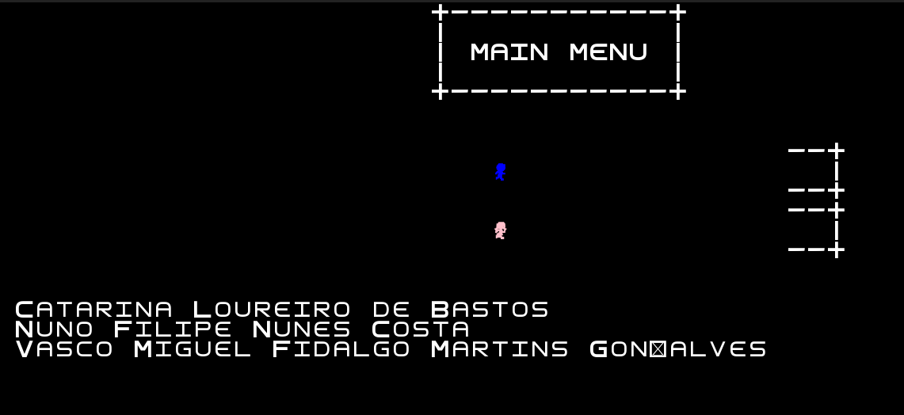 | 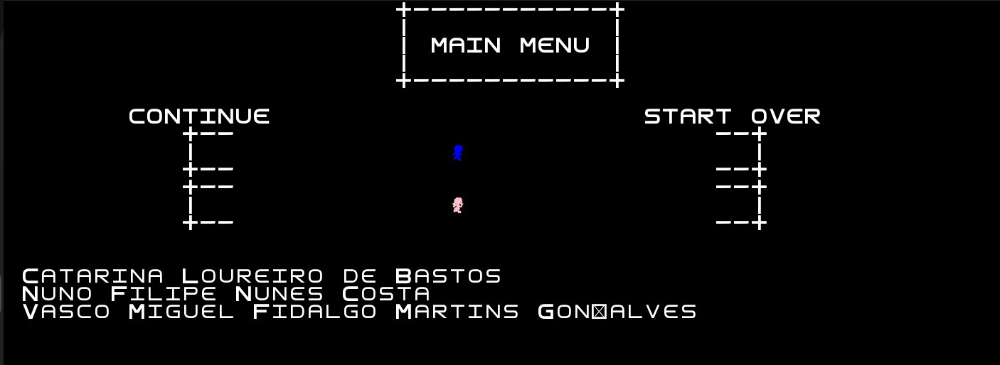 |

---

### Levels

| Level 1 | Level 2 |
| :---: | :---: |
| 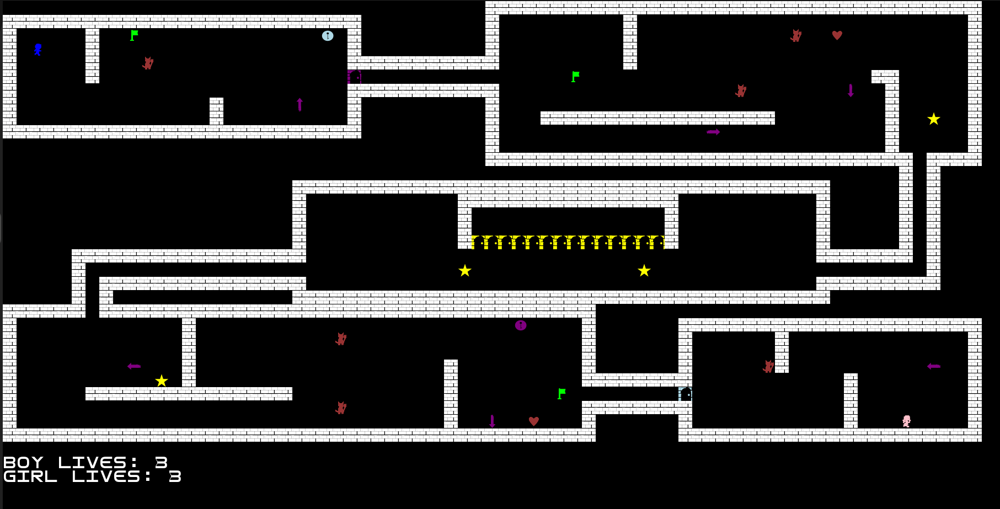 | 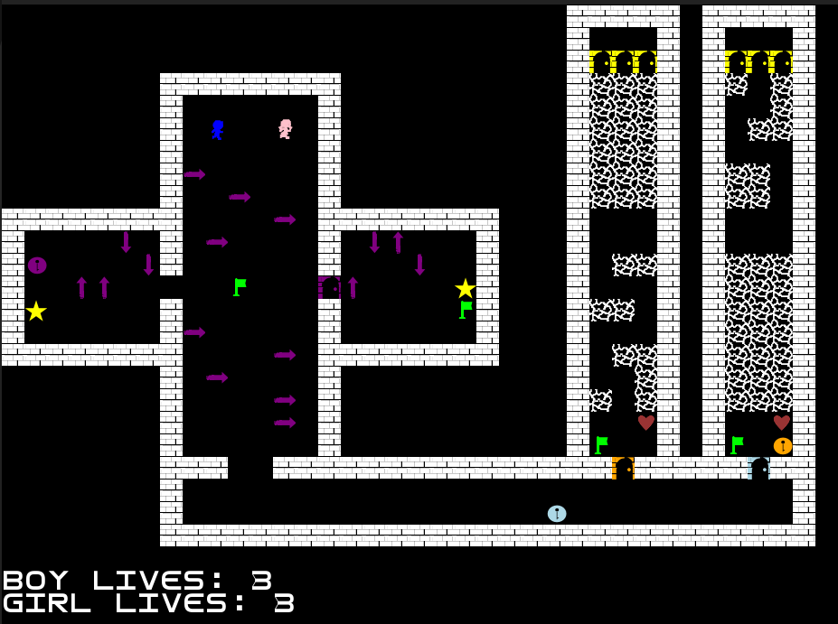 |

| Level 3 | Level 4 |
| :---: | :---: |
| 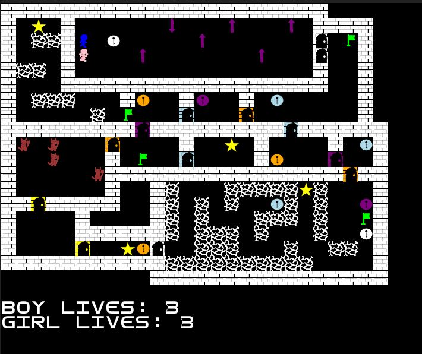 | 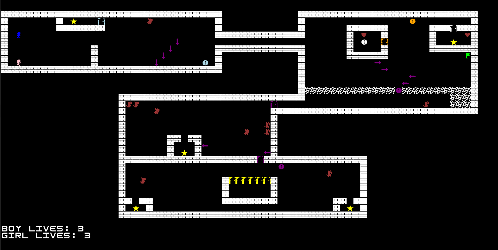 |

---

### Gameplay Animations

| Feature | Preview |
| :--- | :---: |
| **Arrow Movement & Hazards** | 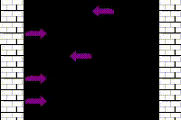 |
| **Checkpoints** | 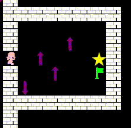 |
| **Timed Doors** | 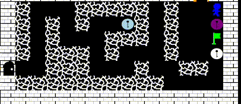 |
| **Enemy Patrolling** | 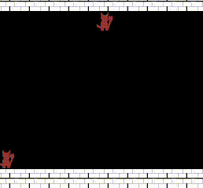 |
| **Fake Floor Hazards** | 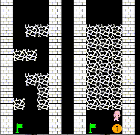 |
| **Heart Collectibles** | 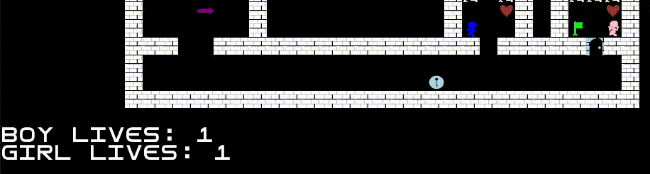 |
| **Door Mechanics** | 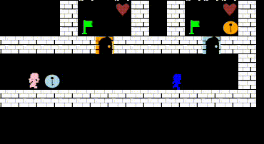 |
| **Pause Menu Interaction** | 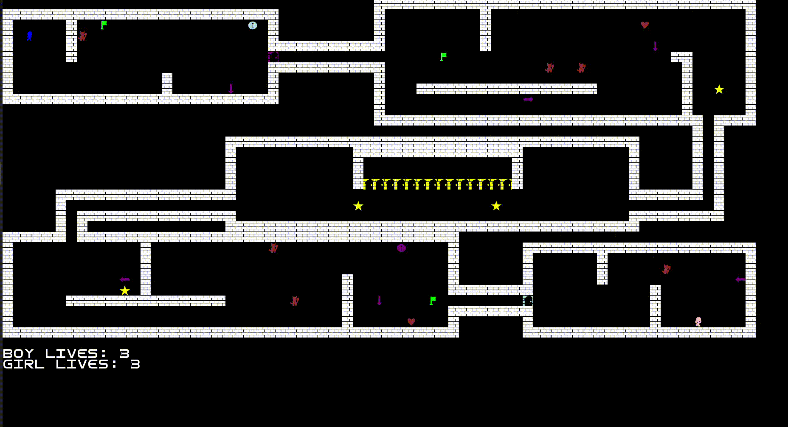 |

#### Level Transitions

| Transition to Level 1 | Transition to Level 2 |
| :---: | :---: |
| 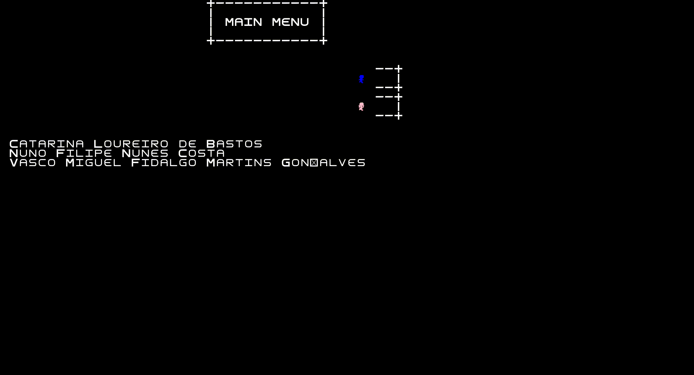 | 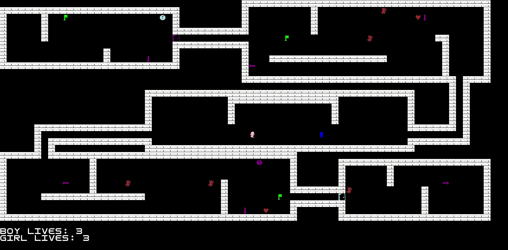 |

| Transition to Level 3 | Transition to Level 4 |
| :---: | :---: |
| 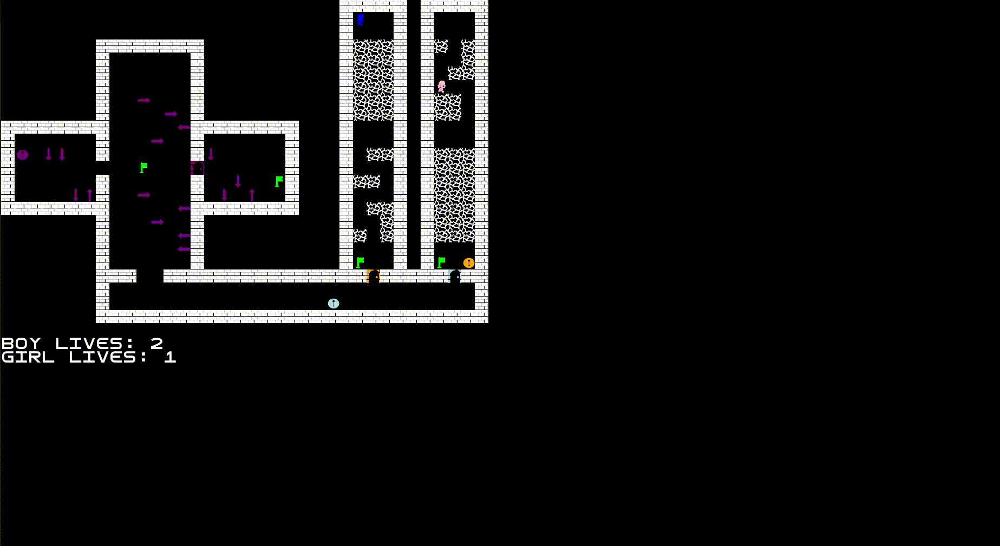 | 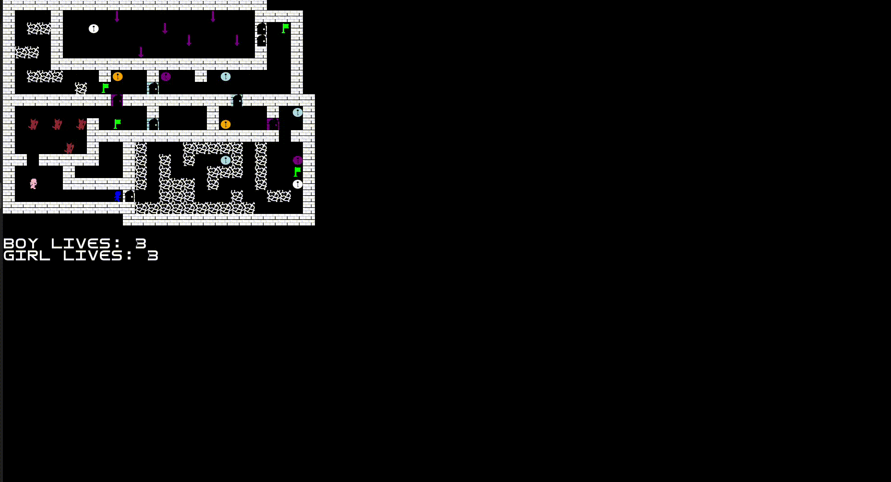 |

---

### Game Completion

| Game Won | Game Lost |
| :---: | :---: |
| 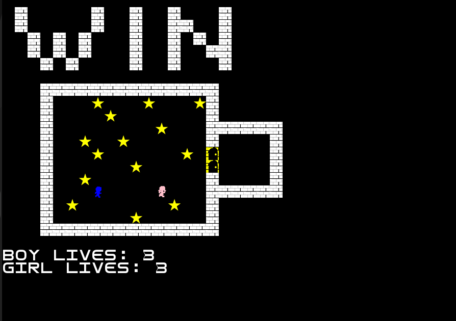 | 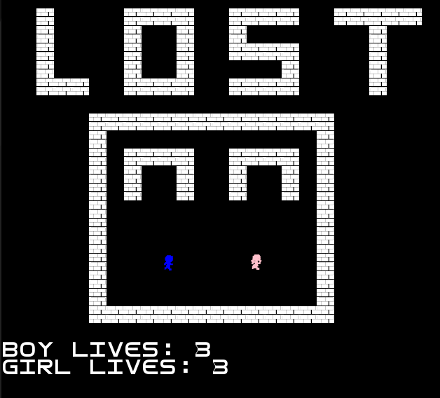 |
| 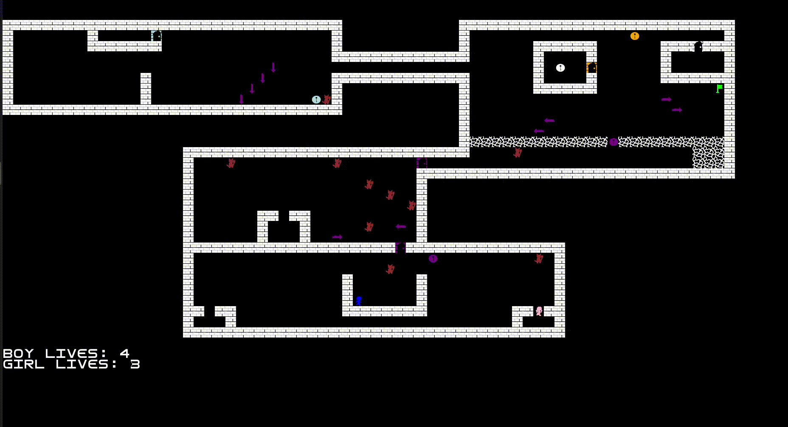 | 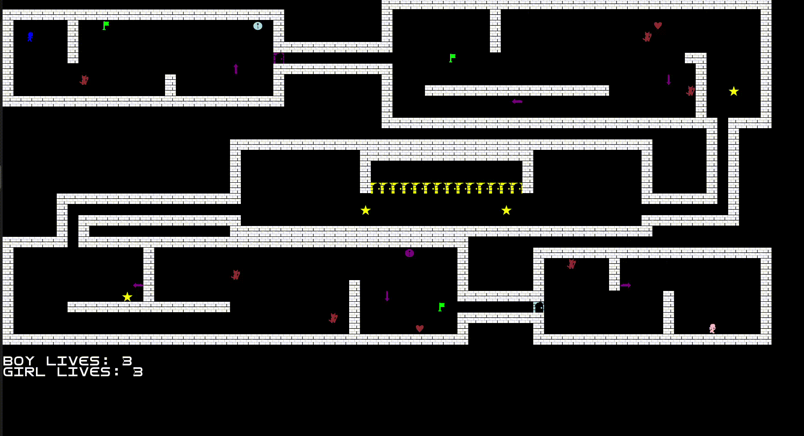 |

---

## Architecture & Design Patterns

The project incorporates established software design principles and patterns to ensure clean separation of concerns:

- **Model-View-Controller (MVC) & State Pattern**: Separates data, rendering, and logic while cleanly transitioning between game states (Menu, Level, Pause, Game Over).
- **Observer / Listener Pattern**: Listens reactively for keyboard events and updates UI listeners, avoiding resource-heavy polling loops.
- **Composite Pattern**: Treats individual game components and composite object collections uniformly through a shared interface.
- **Singleton Pattern**: Ensures single instance access for core managers like `GameController`, `MenuController`, and `LanternaGui`.

For full design pattern breakdowns, implementation details, and UML diagrams, see the [Main Project Report](docs/README.md).

---

## Tech Stack

- **Language**: Java
- **GUI Framework**: Lanterna 3.1.1 (Terminal Graphics)
- **Build System**: Gradle
- **Testing**: JUnit 5, Mockito, JQwik (Property-based testing), PITest (Mutation testing)

---

## Development Team

Developed by Group `LDTS_T13_G08`:

- **Catarina Bastos** - up202307631@up.pt
- **Nuno Costa** - up202305503@up.pt
- **Vasco Gonçalves** - up202305513@up.pt

---

## License

This project is open-source under the [MIT License](LICENSE).
