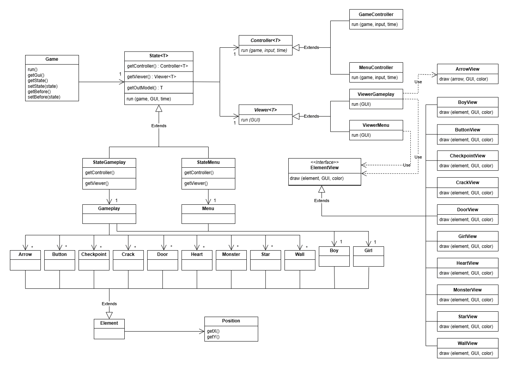
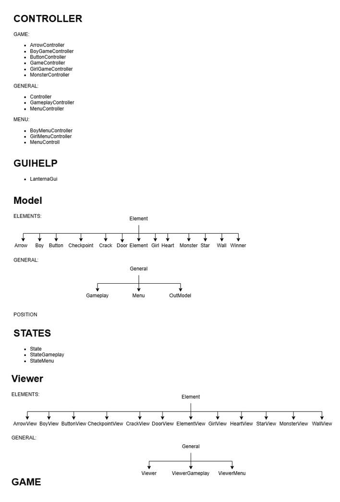
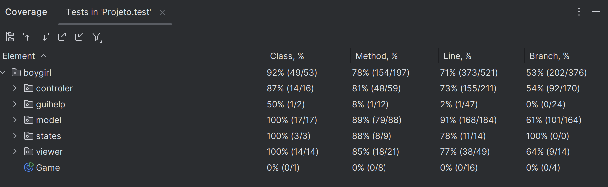

# LDTS_T13_G08 - BoyGirl Game

## Game Description

BoyGirl Game is a cooperative puzzle platformer written in Java using the Lanterna terminal GUI library. Two players navigate through rooms containing enemies, obstacles, and collectibles. The game relies on teamwork: players step on buttons to open timed doors for each other, avoid patrolling monsters and directional traps, collect hearts to restore lives, and reach stars to advance across levels of increasing difficulty.

This project was developed for the **Laboratório de Desenho e Tecnologia de Software (LDTS)** course at **FEUP** by:
- **Catarina Bastos** (up202307631@up.pt)
- **Nuno Costa** (up202305503@up.pt)
- **Vasco Gonçalves** (up202305513@up.pt)

---

## Implemented Features

- **Keyboard Control**: Direct input handling that routes key commands to the active game state.
- **Player Movement**: Independent controls for two players (`W`, `A`, `S`, `D` for Player 1; Arrow keys for Player 2).
- **Collision Detection**: Precise collision checking between players, walls, hazards, enemies, and items.
- **Cooperative Multiplayer**: Designed for local two-player cooperative gameplay.
- **Level Progression**: Four distinct levels with custom layouts and escalating difficulty.
- **Enemies & Hazards**: Patrolling monsters moving across the map and arrows traveling along straight paths.
- **Interactive Buttons & Doors**: Buttons pressed by one player unlock timed doors to allow the other player to progress.
- **Checkpoint System**: Respawn mechanics that return players to recent checkpoints upon death without restarting the entire level.
- **Life System & Collectibles**: Life counter tracking player health, supplemented by heart items scattered across levels.
- **Risky Floors**: Environmental traps featuring alternating safe and lethal floor segments.

---

## Design Patterns

### General Structure (MVC & State Pattern)

#### Problem
Organizing the architecture of a terminal-based GUI game with multiple screens (menus, active levels, pause states, game over screens) can lead to tightly coupled code if UI rendering, user input, and game state logic are mixed together.

#### Pattern
We combined the **Model-View-Controller (MVC)** architectural pattern with the **State Pattern**. MVC separates data models, rendering logic, and input/game logic. The State Pattern manages transitions between distinct runtime states (Menu, Gameplay, Pause, Win, Game Over).

#### Implementation
- **Model**: Stores entity positions, map layouts, player attributes, and game state variables.
- **View**: Handles Lanterna GUI rendering and visual presentation.
- **Controller**: Processes user actions and updates models accordingly.
- **State**: Encapsulates state-specific controllers and viewers, allowing seamless transitions.

#### Consequences
- Clear separation between UI rendering and domain logic.
- Explicit state transitions, simplifying addition of new menus or levels.
- Improved testability and maintainability across components.

---

### Observer / Listener Pattern

#### Problem
Polling keyboard inputs in a dedicated loop can be computationally inefficient, repeatedly checking for key events even when no keys are pressed.

#### Pattern
We implemented the **Observer / Listener Pattern** to handle input events reactively, notifying relevant handlers only when an actual keyboard event occurs.

#### Implementation
Observers registered within the main `Game` class listen for Lanterna terminal input events. Input events are dispatched to the active state controller. This pattern is also used to trigger UI updates when player lives change or when a game over event occurs.

#### Consequences
- Adheres to the Single Responsibility Principle by decoupling input detection from game logic.
- Eliminates unnecessary CPU usage from polling loops.
- Simplifies registering new event handlers or UI listeners.

---

### Composite Pattern

#### Problem
Managing and rendering individual game elements (players, walls, enemies, stars) individually would require repetitive rendering loops and unorganized drawing logic.

#### Pattern
The **Composite Pattern** organizes objects into tree structures to represent part-whole hierarchies, allowing single objects and groups of objects to be treated uniformly through a shared interface.

#### Implementation
All drawable game elements (Boy, Girl, Wall tiles, Stars, Doors) implement a common component interface. Complex structures (such as collections of walls or active enemies) can be rendered using the same drawing methods as individual entities.

#### Consequences
- Simplifies rendering loops across heterogeneous game elements.
- Facilitates adding new drawable entities without modifying existing viewer code (Open/Closed Principle).
- Keeps visual rendering code structured and readable.

---

### Singleton Pattern

#### Problem
Central controllers and GUI managers (such as `GameController`, `MenuController`, and `LanternaGui`) must be shared across various states without creating multiple conflicting instances or repeatedly passing reference parameters.

#### Pattern
The **Singleton Pattern** restricts a class to a single instance and provides a global access point to that instance.

#### Implementation
Constructors for key manager classes were set to private, accompanied by static access methods that return the single active instance throughout the application lifecycle.

#### Consequences
- Prevents resource conflicts and state inconsistencies from multiple instantiations.
- Reduces memory overhead by reusing single manager instances.
- Provides consistent global access for shared UI and control operations.

---

## Architecture & UML Diagrams

### Class Diagram
The following class diagram illustrates the overall structure of the application, including models, views, controllers, and states:

  

<i>Figure 1. UML Class Diagram</i>

### Code Structure Diagram
The code structure diagram shows component interactions across models, controllers, viewers, states, and GUI wrappers:

  

<i>Figure 2. Code Structure Overview</i>

---

## Code Quality

No code smells were identified in the final build; code smells and refactoring targets were addressed during development.

---

## Testing & Coverage

### Code Coverage Summary
Unit tests and property-based tests cover key controllers, models, and state logic using JUnit 5, Mockito, and JQwik.

  

<i>Figure 3. Code Coverage Screenshot</i>

### Test Report Link
Detailed test execution results can be viewed in the generated HTML report: [Test Report](tests/test/index.html).

---

## Self-Evaluation

Work was distributed equally among all team members:

- **Catarina Bastos**: 33.3%
- **Nuno Costa**: 33.3%
- **Vasco Gonçalves**: 33.3%
